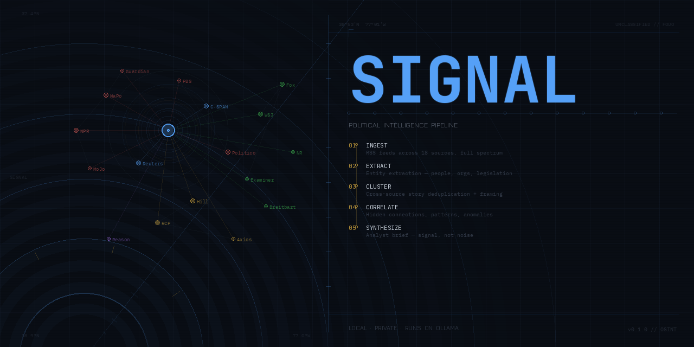

# Signal — Political Intelligence Pipeline

[](https://github.com/flexrpl/signal/actions/workflows/ci.yml)
[](https://sonarcloud.io/summary/new_code?id=fleXRPL_signal)
[](https://sonarcloud.io/summary/new_code?id=fleXRPL_signal)

[](https://flexrpl.github.io/signal/)

A fully automated political intelligence pipeline. Ingests RSS feeds across the full political spectrum, runs a five-pass analysis, and publishes a daily HTML brief to GitHub Pages. Automatically posts three social cards to Bluesky each day — watch list, spectrum breakdown, and blindspot analysis.

## What it does

```text
[RSS Feeds — 18 sources across the full political spectrum]
         ↓
[Pass 1] Entity extraction per article
         ↓
[Pass 2] Algorithmic clustering (same story, multiple outlets)
         ↓
[Pass 3] Per-cluster framing analysis (left vs center vs right)
         ↓
[Pass 4] Cross-story correlation (hidden connections, patterns, anomalies)
         ↓
[Pass 5] Brief synthesis + brief_data.json (structured card data)
         ↓
[HTML report → GitHub Pages]    [3 social cards → Bluesky at 8AM / noon / 6PM]
```

Everything runs locally. Nothing leaves your machine except the GitHub Pages deploy and Bluesky posts.

## Requirements

- Python 3.11+
- [Ollama](https://ollama.ai) running locally
- At least one model pulled

## Quick start

```bash
# 1. Pull a model (if you haven't)
ollama pull llama3.1:8b        # fast, good for dev (~5GB)
ollama pull qwen2.5:14b        # better reasoning, recommended (~9GB)

# 2. Make sure Ollama is running
ollama serve

# 3. Run Signal
python main.py

# With a specific model
python main.py --model qwen2.5:14b

# Skip full article fetch (faster, less context)
python main.py --no-fetch
```

## Model recommendations (M1 Max 32GB)

| Model | Size | Speed | Quality | Use for |
| ------- | ------ | ------- | --------- | ---------- |
| `llama3.1:8b` | ~5GB | Fast | Good | Development, quick runs |
| `qwen2.5:14b` | ~9GB | Medium | Excellent | Production analysis |
| `mistral:7b` | ~4GB | Fastest | Moderate | Low-resource fallback |

With 32GB unified memory you can comfortably run `qwen2.5:14b`. It meaningfully
outperforms 8b models on the correlation and synthesis passes.

## Output

Each run generates:

- `reports/brief_YYYYMMDD_HHMM.html` — self-contained HTML report
- `reports/brief_YYYYMMDD_HHMM.json` — structured brief data (used by social cards)
- `reports/cards/am_YYYYMMDD.png` — Watch List card (posted at 8:00 AM)
- `reports/cards/noon_YYYYMMDD.png` — Spectrum Breakdown card (posted at noon)
- `reports/cards/pm_YYYYMMDD.png` — Blindspot Analysis card (posted at 6:00 PM)
- `signal.db` — SQLite database with all articles, clusters, and analyses

The HTML report includes:

- Full intelligence brief (Situation Overview, Key Dynamics, What Isn't Being Said, etc.)
- Per-story breakdown with left/center/right framing and omissions
- Cross-story connections and patterns
- Blindspot analysis (stories only covered by one side)
- Watch list for the next 48-72 hours
- Source index

## Configuration

Edit `config/sources.yaml` to:

- Change the Ollama model
- Add/remove RSS sources
- Adjust article age limits
- Tune clustering thresholds

## How the intelligence layer works

The key insight is that Pass 4 doesn't see the articles at all — it sees the
*analyses* of clusters, plus an entity network showing which actors appear
across multiple unrelated stories. This is where non-obvious connections emerge.

Pass 5 is explicitly instructed NOT to summarize the news — it's prompted to
write like an analyst who has read everything and is telling you what's actually
happening, not what the outlets claim is happening.

## Database

`signal.db` accumulates across runs. This enables:

- Delta detection (what changed since the last run)
- Watch list tracking (did watched items materialize?)
- Trend analysis over time

```bash
# Inspect the database
sqlite3 signal.db
.tables
SELECT count(*), source_name FROM articles GROUP BY source_name;
```

## Social cards (Bluesky)

Three cards are generated automatically each morning and posted at scheduled times:

| Slot | Time | Card | Content |
| ---- | ---- | ---- | ------- |
| AM | 8:00 AM | Watch List | Time-coded items flagged for monitoring |
| Noon | 12:00 PM | Spectrum Breakdown | Top story — how each side covers it |
| PM | 6:00 PM | Blindspot Analysis | What each side isn't reporting |

**Full command runbook (copy-paste setup, test, launchd, logs):**

- Repo: [docs/social-cards-setup.md](docs/social-cards-setup.md)
- Wiki: [Social-Cards](https://github.com/fleXRPL/signal.wiki/wiki/Social-Cards)

Quick test after `.env` is configured:

```bash
.venv/bin/python post_scheduled.py --slot am --dry-run
```

## Project structure

```bash
signal/
├── .github/
│   └── workflows/
│       ├── ci.yml               # pytest on every PR + push to main
│       └── static.yml           # GitHub Pages deploy on push to main
├── config/
│   └── sources.yaml             # feed list + model config
├── pipeline/
│   ├── __init__.py
│   ├── store.py                 # SQLite persistence
│   ├── collector.py             # RSS + article scraping
│   ├── prompts.py               # all LLM prompts
│   ├── analyzer.py              # 5-pass analysis pipeline
│   ├── reporter.py              # HTML report + brief_data.json
│   ├── weekly.py                # Pass 6 — weekly synthesis
│   ├── feed.py                  # RSS 2.0 feed generator
│   ├── infographic.py           # Playwright HTML → PNG card renderer
│   ├── social.py                # Bluesky auth, upload, post
│   └── templates/
│       ├── card_watch.html      # AM watch list card template
│       ├── card_spectrum.html   # Noon spectrum breakdown template
│       └── card_blindspot.html  # PM blindspot analysis template
├── tests/                       # pytest suite (164 tests, 91% coverage)
├── reports/
│   ├── cards/                   # generated PNG card images
│   └── posts/                   # pre-generated JSON post packages
├── scripts/                     # launchd plists
├── post_scheduled.py            # CLI dispatcher for social posts
├── main.py                      # entry point
├── .env.example                 # credential template
├── pytest.ini
├── requirements.txt
└── signal.db                    # runtime database (gitignored)
```

## Infographic


